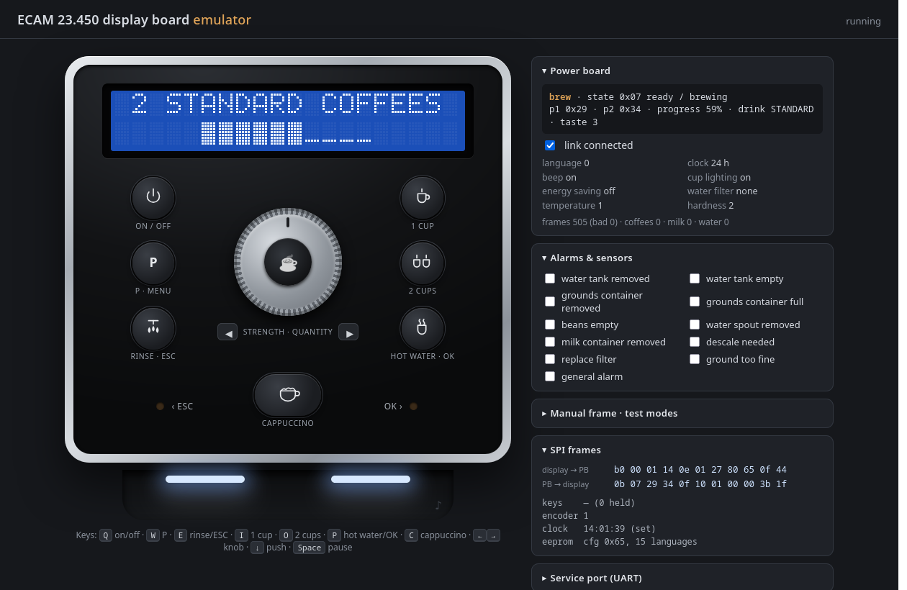

# ECAM 23.450 emulator

This emulator runs the **original display board firmware** (or any PIC16F916 image, including the C rebuild in `../reimplem` once it has been compiled with XC8) on an emulated PIC.
The power board on the other end of the SPI link can be either of these; switch between them with the buttons at the top of the page:
- **Emulated firmware** (default): the original power board firmware on an emulated PIC18F4525. It drives a physical model of the machine (thermoblocks, pump and flowmeter, grinder, brew unit, valves, switches), so every load you see switched on was switched on by the real firmware.
- **Stub:** a simplified state machine written for this emulator. It is quick, and every screen and alarm can be forced from the side panel. It drives the same machine model with invented timings, so the views work in both modes.

Two views show what the machine does:
- **Under the spout**, below the control panel: the coffee spout with its cup lights, the cup filling (coffee with crema, milk foam, water), the hot water spout or the milk carafe, steam, and the drip tray. Each drink gets its own cup; the previous ones are listed as "served".
- **Inside the machine**, at the bottom: tank level, pump and flowmeter (with its pulse count), both thermoblocks with their heaters and NTC readings, the valves, the bean hopper and grinder, the brew unit (piston, coffee cake, switches, motor, and the travel the firmware measured), the grounds container, and a live list of the power board's input and output pins. The pipes show where the water is flowing. The hydraulic layout is a model, not a drawing of the real circuit.



## Running it

The page loads the firmware and EEPROM images from `files/`, so serve the **repository root** over HTTP:

```sh
cd <repo root>
python3 -m http.server 8000
# then open http://localhost:8000/ecam23.450_displayboard_reverse/emulator/web/
```

You can also load other images from the "Emulator" box: a `.bin` dump or an XC8 `.hex` for the firmware, a 32 KiB `.bin` for the EEPROM.

**Controls:**

| Control | Mouse | Keyboard |
|---------|-------|----------|
| Buttons | click (hold for long presses) | <kbd>Q</kbd> on/off, <kbd>W</kbd> P/menu, <kbd>E</kbd> rinse/ESC, <kbd>I</kbd> 1 cup, <kbd>O</kbd> 2 cups, <kbd>P</kbd> hot water/OK, <kbd>C</kbd> cappuccino |
| Knob | drag the ring, use the wheel, or click the centre to push | <kbd>←</kbd> <kbd>→</kbd> to turn, <kbd>↓</kbd> to push |
| Pause | | <kbd>Space</kbd> |

**Service mode:** use "Restart in service mode" (or hold the knob while pressing "Power cycle"). You can then send the UART service commands from the side panel.

**The machine:**
- **Under the spout:** fit the hot water spout, the milk carafe or nothing (hot water needs the spout, milk needs the carafe), serve the cup or remove it (the coffee then goes into the drip tray), empty the tray, refill the milk.
- **Inside the machine:** click the tank to take it out or put it back, the bean hopper to refill it, and the grounds container to empty it.
- **Machine box in the side panel:** the same, plus filling or emptying the tank and emptying the hopper.

**Side panel:**
- **Power board:** the state it reports; for the stub, its settings and counters; for the emulated firmware, its CPU.
- **Stub alarms:** the alarms that do not come from the machine model (descaling, filter, ground too fine, general fault).
- **Manual frame** (stub): send any power board frame, with presets for the factory test modes (display/button test, load test, electric test steps, …).
- **SPI frames:** the last frames in both directions, decoded.
- **Emulator:** pause, speed, power cycle, LCD colour, and whether the RTC starts as "set".

`?pb=real` or `?pb=stub` picks the power board at load.
`?demo=standby|ready|brew|menu|alarm|cappu|hotwater` runs a scripted sequence on the stub before the first frame, which is handy for screenshots.
With `?pb=real`, `?demo=warmup|coffee|cappu2` does the same on the real power board firmware.

## Tests

`test/scenarios.js` boots the firmware and drives it through:
- boot and standby;
- warm-up, brewing and the progress bar;
- alarms;
- the menu and a language change;
- setting the clock;
- losing the power board link;
- the factory test modes;
- UART service mode: read, write and EEPROM checksum.

Two more scenarios use the machine model:
- `realpb` runs both original firmwares together against the machine model: warm-up, a coffee (grind, compaction, pre-infusion, dose, coffee out of the spout, puck ejection), then a coffee with an empty bean hopper;
- `stubplant` runs the stub against the machine model: rinse water and coffee out of the spout, the puck, the tank alarm, milk from the carafe.

Each run checks the LCD text, the RTC, the buzzer and the SPI traffic. All 56 checks pass.

```sh
node test/run.mjs                 # or: node test/run.mjs brew,menu
# without Node: serve the repo and open emulator/test/run.html
```

**Testing firmware builds.** `run.html?dfw=<path>` replaces the display firmware and `run.html?pbfw=<path>` the power board firmware, with paths from the repository root. The XC8 builds of `reimplem/` and `pb_reimplem/` pass all 56 checks, alone or together. With a build that has an XC8 `.sym` next to its `.hex`, the checks that look at a firmware variable take its address from there.

`test/fwprobe.html?dfw=...&dsym=...` (or `pbfw` / `pbsym`) is for debugging a build. It runs the firmware for a few seconds and reports:
- where the CPU spends its time, per function;
- the interrupt rate and load;
- the LCD and the SPI frames;
- for each watchdog reset, the code that ran just before it.

The power board file picker in the Emulator box also loads a `.hex` build.

## What is emulated

| Part | Model |
|------|-------|
| `core/firmware.js` | PIC16 `.bin` / `.hex` loaders, and `.hex` → programmer image for the PIC18. |
| `core/pic16f916.js` | Full 35-instruction core with banking, 8-level stack and cycle counts. Peripherals: TMR0 with prescaler and write inhibit, WDT (resets are counted), TMR1, TMR2 + CCP1 PWM, SSP (SPI master), USART with baud timing, ports with read-modify-write on the pins, interrupts. The oscillator follows OSCCON. |
| `core/i2c.js` | Bit-level open-drain I2C bus with the ST7036 LCD (DDRAM, CGRAM, instruction set), the M41T00 RTC (runs in emulated time, ST/OUT bits) and the M24256 EEPROM (64-byte pages, /WC pin, 5 ms busy after a write). |
| `core/board.js` | Key matrix and encoder (active levels taken from the schematic), the 74HC4052 link mux, and the LED / backlight / cup light / buzzer outputs, sampled as duty cycles. |
| `core/powerboard.js` | SPI slave and a plausible machine state machine: standby → warm-up → rinse → ready, brewing, milk, hot water, rinse, the settings menu, alarms. **It is not the real power board firmware.** Timings and sequences are invented; the screens are the real firmware's. |
| `core/pic18f4525.js` | PIC18 core (full instruction set, indirect addressing, shadow registers, 31-level stack), TMR0-3, CCP1 capture, ADC, MSSP as SPI slave, EUSART, data EEPROM writes, WDT, interrupts. |
| `core/realpb.js` | The real power board firmware on that core, with the same interface as the stub. |
| `core/plant.js` | The machine around the power board: 50 Hz mains and zero-cross, two thermoblocks (heating element, block and NTC, so the regulation overshoots like a real one), pump and flowmeter, grinder and bean hopper, brew unit motor with its encoder and switches (the top switch closes earlier with more coffee in the chamber), tank and water level, grounds container, hot water spout or milk carafe, drip tray, and what comes out where. The constants are fitted to the firmware's own thresholds (see `docs/powerboard.md`), not measured. |
| `core/stubplant.js` | Drives the machine model from the stub's phases, and the stub's physical alarms from the model. |
| `web/cupview.js`, `web/insideview.js` | The "under the spout" and "inside the machine" views. They are advanced in emulated time, so they stay right at any emulator speed. |
| `web/` | The front panel. The LCD uses a 5×7 font; the ST7036's European/Cyrillic ROM codes are mapped from the texts (best effort), and CGRAM glyphs come from the emulated controller. |

The screen is recomputed from the real firmware and real EEPROM contents, and the timings are those of the firmware.
Two caveats:
- The encoder is modelled as a hand-turned knob, 15 ms per quadrature phase. The firmware polls it once per main-loop pass, and a pass can take ~12 ms while the LCD is being redrawn.
- The LCD font for codes ≥ 0x80 is a reconstruction.

## Recording the power board for the C reconstruction

`test/pb_trace.html` runs both firmwares through a long session (brews, hot water, cappuccino, menu, alarms, UART service commands, factory tests). It records calls of the original power board functions: RAM and SFRs at entry, RAM at return. `pb_reimplem/` replays the records against its C code (`make difftest`, see `pb_reimplem/README.md`). The records are POSTed to `/log`: serve the repository root with `python3 emulator/test/logserver.py trace.log` instead of `http.server`, open `…/emulator/test/pb_trace.html` and wait for `__END__` at the end of `trace.log` (about 3 minutes).

## Findings made with the emulator

- The UART service command codes are **0x85 / 0x95 / 0xB3**. The static analysis had read them as 0x85 / 0x10 / 0x26; that is fixed in `reimplem/` and `docs/`.
- When the power board link is lost, the text lines blank, but the standby clock overlay stays frozen on screen. This is a quirk of the original firmware, reproduced here.
- The service mode EEPROM checksum takes about 11 s: 32 KiB go through the bit-banged I2C.
- Power board: the brew unit stroke up to the top switch measures the coffee dose. A short stroke means *too much* coffee ("LESS COFFEE"), not too little. The analysis notes had it the other way round.
- Power board: RA5 is the **milk carafe** detector (low = fitted). Milk drinks ask for the container without it, hot water refuses to run with it, and in energy saving mode the machine only keeps the thermoblocks hot when the carafe is fitted. Without it, the coffee side is kept around 50 °C and heated just before brewing.
